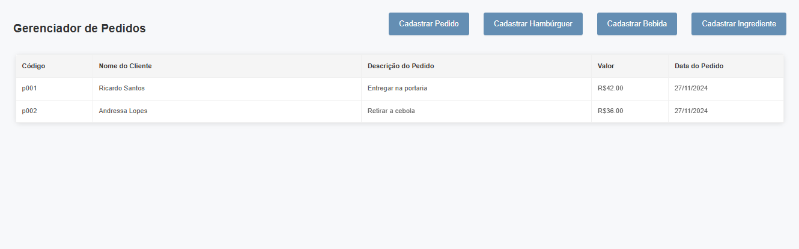
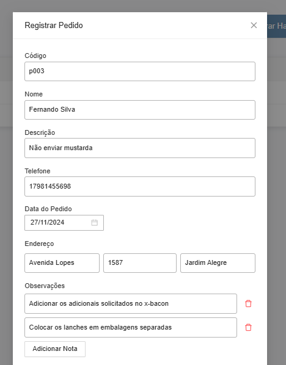
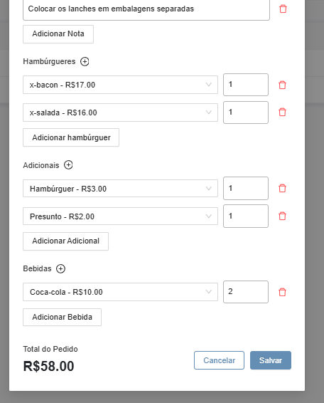
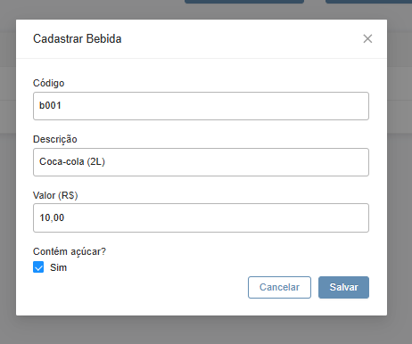
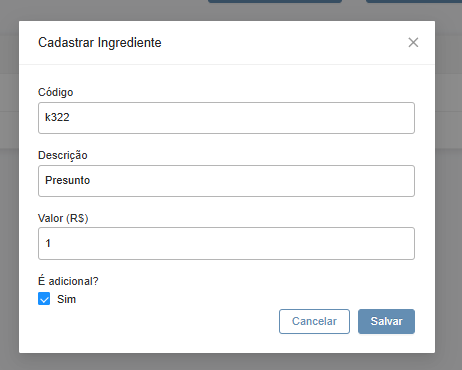
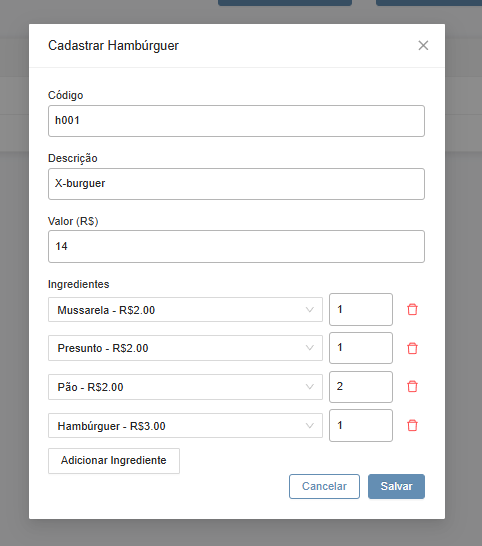

## Descrição

Este é o frontend do "Order Manager", um sistema de gerenciamento de pedidos para uma lanchonete (desafio técnico). O objetivo deste sistema web é gerenciar pedidos, hambúrgueres, bebidas e ingredientes.

## Tecnologias Utilizadas

- **Angular**
- **NgZorro**
- **Typescript**
- **HTML**
- **SCSS**
- **HttpClient**

## Pré-requisitos

Para executar este projeto localmente, você precisará de:

- **Node.js** (versão 18 ou superior)
- **npm** ou **yarn** (gerenciador de pacotes)
- **Angular CLI** (se não tiver, instale com: `npm install -g @angular/cli`)
- **Backend** do projeto rodando (via Docker ou localmente) — para que o frontend consiga consumir a API.


### 1. Clone o Repositório

```bash
git clone https://github.com/natasilva/om-front
cd om-front
```

### 2. Instale as dependências

```bash
npm install
```

### 3. Execute o frontend localmente

```bash
npm run start
```
E acesse a aplicação em: http://localhost:4200

## Prints da Interface

### Tela Inicial
A tela inicial exibe uma listagem de todos os pedidos em uma tabela. Acima da tabela temos 4 botões de cadastro (cadastrar pedido, cadastrar hambúrguer, cadastrar bebida e cadastrar ingrediente). Cada botão abre um modal com o seu respectivo formulário de cadastro.



### Cadastro de Pedidos
Aqui, o usuário pode cadastrar pedidos, inserindo algumas informações, como: código do pedido, descrição do pedido, nome do cliente, telefone do cliente, endereço de entrega e data do pedido.
Ele também pode informar uma lista de observações acerca dos itens solicitados ou da entrega do pedido.



Na mesma tela ele também pode informar uma lista de hambúrgueres, uma lista de bebidas e uma lista de adicionais. O valor total do pedido é exibido em tempo real, no final do formulário. Nesses três campos temos um botão com um ícone de "+", e cada um deles abre um modal para cadastro de seu respectivo item.



### Cadastro de Bebidas
Aqui, o usuário pode cadastrar bebidas, inserindo algumas informações, como: código da bebida, descrição da bebida, valor da bebida e se a bebida possui ou não açúcar.



### Cadastro de Ingredientes
Nessa tela, o usuário pode cadastrar ingredientes, inserindo algumas informações, como: código do ingrediente, descrição do ingrediente, valor do ingrediente e se o ingrediente é ou não um item adicional.



### Cadastro de Hambúrgueres
Nessa tela, o usuário pode cadastrar hambúrgueres, inserindo algumas informações, como: código do hambúrguer, descrição do hambúrguer, valor do hambúrguer e uma lista de ingredientes para a montagem do hambúrguer.


